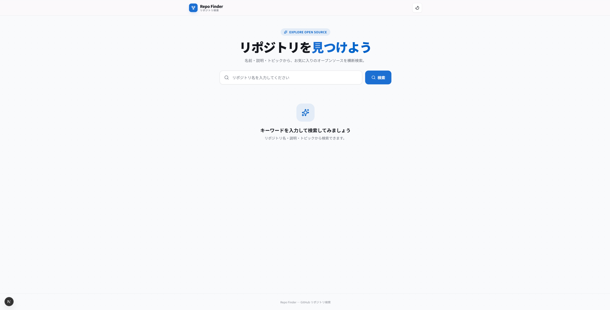
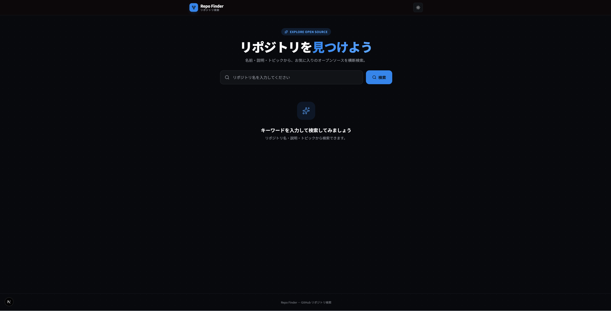
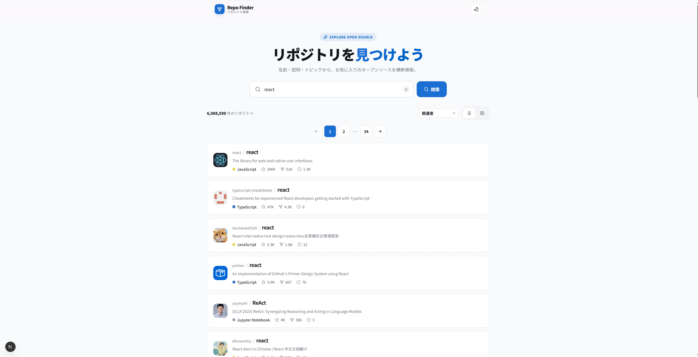
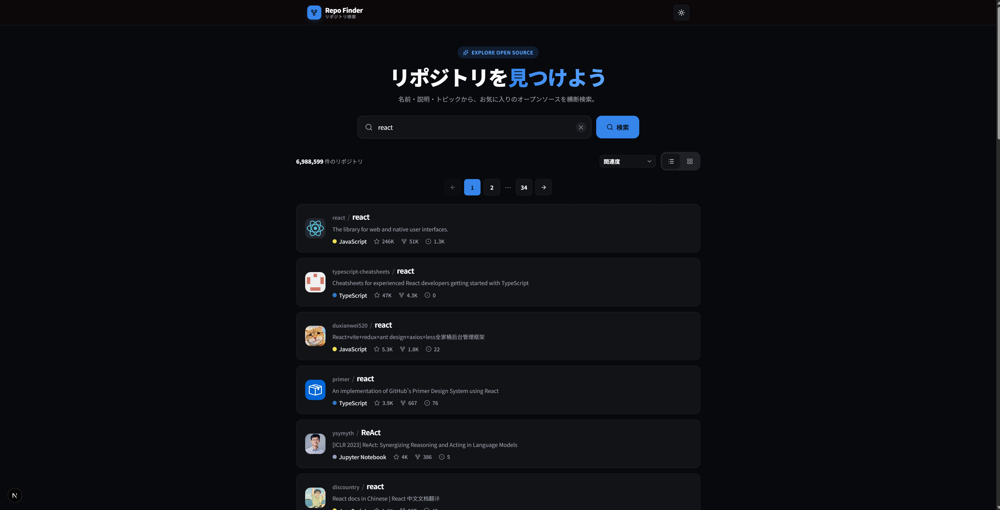
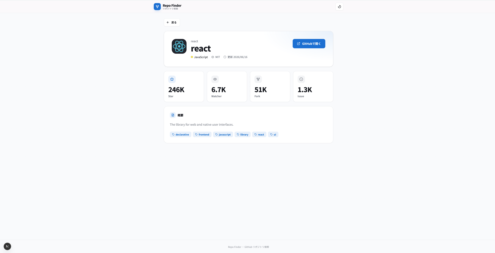
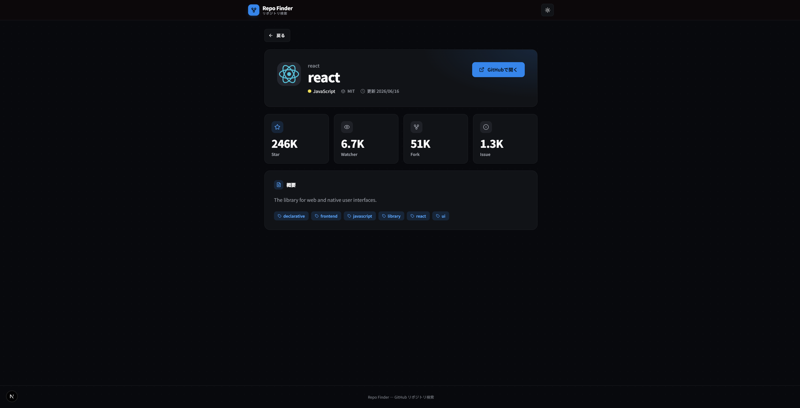

# Repo Finder（GitHub リポジトリ検索アプリ）


## スクリーンショット

### 初期画面




### 検索画面




### 詳細画面




<!-- TODO: 完成時にスクリーンショットを置く（ライト/ダーク両方） -->

GitHubの公開リポジトリをキーワードで検索し、一覧・詳細を閲覧できるWebアプリケーション。
Next.js 16（App Router）/ React 19 / TypeScript で実装。

---

## セットアップ・起動方法

```bash
# 前提: Node.js 22 LTS（最低 20.9+）/ npm

# 1. 依存のインストール
npm install

# 2. 環境変数の設定（GitHubトークン）
#    .env.example をコピーして GITHUB_TOKEN を設定
#    ※ トークン未設定でも動作するが、レート制限が厳しくなる（検索 10req/分）
cp .env.example .env.local

# 3. 開発サーバー起動
npm run dev

# テスト実行
npm test          # ユニット・コンポーネント・結合（Vitest）
npm run test:e2e  # E2E（Playwright）
```

### GitHub アクセストークンの取得方法

公開リポジトリの検索・取得のみのため、**追加の権限（スコープ）は一切不要**です。

1. GitHub にログインし、[Personal access tokens (classic)](https://github.com/settings/tokens) を開く
   （画面からたどる場合: 右上アイコン → **Settings** → 左メニュー最下部 **Developer settings** → **Personal access tokens** → **Tokens (classic)**）
2. **Generate new token (classic)** をクリック
3. **Note** に用途（例: `repo-finder`）を入力し、**Expiration** は任意（30日程度を推奨）
4. **スコープのチェックボックスはすべて未チェックのまま**にする（公開情報の読み取りに権限は不要。最小権限の原則）
5. **Generate token** をクリックし、表示されたトークン（`ghp_` で始まる文字列）をコピー
   ※ トークンはこの画面でしか表示されないため、閉じる前に必ずコピーする
6. `.env.local` の `GITHUB_TOKEN=` の後ろに貼り付ける

> Fine-grained tokens でも動作するが、本アプリは公開情報のみのため classic の無スコープで十分。
> トークンは `.env.local`（gitignore 済み）にのみ置き、コミットしないこと。

---

## 技術スタック

| 区分 | 採用 |
| --- | --- |
| フレームワーク | Next.js 16.2 系（App Router） |
| 言語 / ランタイム | TypeScript 5.x / React 19.2 / Node.js 22 LTS |
| スタイリング / UI | Tailwind CSS 4.x / shadcn/ui |
| テーマ | next-themes（ダーク/ライト） |
| テスト | Vitest / React Testing Library / MSW / Playwright |
| CI | GitHub Actions（lint・型チェック・テスト） |

選定理由・不採用技術・バージョン方針の詳細: [docs/TECH_STACK.md](./docs/TECH_STACK.md)

---

## 設計判断とトレードオフ

### データ取得は Server Components（サーバーフェッチ）

GitHub API の取得を RSC でサーバー側に置く。トークンをクライアントに晒さず、初期 JS を削減でき、Next 16 のネイティブな構成に沿う。代替案のクライアント取得＋データ取得ライブラリ（TanStack Query 等）は、無限スクロールやミューテーション主体なら有力だが、本アプリは読み取り・ページネーション主体のため採らない。

### URL を状態の単一の真実とする

検索キーワード・ソート・ページ（q/sort/order/page）を URL に同期し、共有・リロード・ブラウザバックで画面が再現される。例外として、テーマと表示形式（リスト/グリッド）は閲覧者個人の表示設定で共有対象でないため localStorage に置く。「共有・再現すべき結果の状態か、個人の見た目の好みか」で置き場所を分けている。

### Watcher数の罠への対応

GitHub の `watchers_count` は実際には Star 数のエイリアスで、真の Watcher 数は `subscribers_count`。これは検索結果に含まれないため、詳細ページは検索結果を使い回さず `GET /repos/{owner}/{repo}` を再取得する。詳細が一覧に依存しない自己完結ページになる利点もある。

### アンチコラプションレイヤ（アダプタ）

GitHub の生レスポンスを、アダプタ層でアプリ独自のドメイン型に変換する。Watcher 数の罠や URL スキーム検証もここで吸収し、API の癖や将来の変更の影響を `lib/github` に局所化する。UI はドメイン型だけを見る。

### 並び替えはサーバーソート（API委譲）

検索は最大 1000 件・ページング前提のため、クライアントソートは「現在ページ内 30 件だけの並べ替え」になり誤り。ソートは API に委譲する。モックにあった名前順・Issue 数順は GitHub API の sort に存在しない/意味が異なるため不採用とした。

### 検索は submit 方式

検索はボタンまたは Enter で確定する。逐次（input ごとの）検索はレート制限（認証あり 30req/分）に厳しく、意図しないリクエストを生む。確定操作としての submit が、レート制限にもユーザーの意図にも自然。

設計の全体像: [docs/Philosophy/DESIGN_PHILOSOPHY.md](./docs/Philosophy/DESIGN_PHILOSOPHY.md) / 各設計書は「ドキュメント一覧」参照

---

## やらないこと（スコープ外）と理由

- **認証ログイン** — 検索・閲覧が主目的のため不要
- **無限スクロール** — 「戻る」の位置復元とSSRの相性で複雑性が跳ね上がる。GitHub APIの1000件上限・ページネーションと噛み合うため、ページネーションを採用
- **グローバル状態管理（Redux等）** — サーバー状態=RSC / 共有状態=URL / ローカル状態=useState・localStorage で充足。導入理由がない

---

## 使った Next.js の機能

- App Router / Server Components（データ取得・初期JS最小化）
- `searchParams` / `params` の await（Next 16 の Promise 化に対応）
- `loading.tsx`（Suspense・スケルトン）/ `error.tsx`（再試行）/ `not-found.tsx` + `notFound()`
- 動的ルート `repositories/[owner]/[repo]`
- `generateMetadata`（リポジトリごとの動的メタデータ）
- `next/image`（アバター最適化）
- キャッシュ方針: 永続キャッシュ（`revalidate` 等）は設けず毎回最新を取得。Star/Watcher 数など表示データが変動するため。詳細ページのみ `React.cache` で同一リクエスト内の取得（generateMetadata とページ本体）を重複排除

---

## テスト

```bash
npm test          # ユニット・コンポーネント・結合（Vitest）
npm run test:e2e  # E2E（Playwright）
```

方針の要約:

- **4層構造**: ①ユニット（最も壊れやすいロジック）/ ②コンポーネント（UIの責務）/ ③結合（繋いだときの正しさ）/ ④E2E（実際のユーザー体験）を、各層の保証対象で役割分担
- **配分はテスティングトロフィー**: 静的解析 > ① > ③（最厚）> ④
- **振る舞いをテスト**: role / label / text で検証し、実装詳細に依存しない
- **MSWで境界モック**: ネットワーク境界のみモックし、内側は本物を動かす
- **アダプタはテストファースト**: APIとUIの契約を先にテストで固定

### テスト構成

| 層 | ツール | 対象 |
| --- | --- | --- |
| 静的解析 | TypeScript（strict）/ ESLint | 全体 |
| ① ユニット | Vitest | アダプタ・フォーマット・APIクライアント・言語色 |
| ② コンポーネント | Vitest / RTL | カード・検索ボックス・ソート・表示切替・ページネーション・テーマ・詳細・空状態 |
| ③ 結合 | Vitest / RTL / MSW | 検索フロー・詳細フロー（Watcher 数の罠の検証を含む） |
| ④ E2E | Playwright | 検索→一覧→詳細→戻る（ハッピーパス・chromium） |

Vitest（①②③）と E2E（④）はランナーを分離（`npm test` / `npm run test:e2e`）。Vitest は計 62 本、E2E は 1 本。

詳細: [docs/Philosophy/TEST_PHILOSOPHY.md](./docs/Philosophy/TEST_PHILOSOPHY.md)

---

## AI利用レポート

### 分担の原則

**判断は人間、実行（調査・文書化・生成）はAI、出力のレビューと採否の決定は人間。**

### 工程ごとの分担

| 工程 | AIの役割 | 人間の役割 | 人間がレビュー・修正した点 |
| --- | --- | --- | --- |
| 要件定義 | ドキュメント作成・要件の提案・整理 | 要件の提案・トレードオフの判断 | ドキュメント内容のレビュー |
| 設計（基本/詳細） | ドキュメント作成・設計の壁打ち・設計の提案 | 設計思想の決定・設計壁打ち・設計の判断 | ドキュメント内容のレビュー |
| API仕様調査 | 調査 | 内容のレビュー | なし |
| 実装 | コード生成・実装方針の提案・エラーの原因特定 | 実装方針の決定・コードレビュー・動作確認・採否判断 | view の状態管理方式（URL→localStorage）、フォーカスリングの視認性、戻る挙動の不具合など、提案や初期実装を実機確認のうえ修正 |
| テスト | テストコード生成・テスト観点の提案・失敗原因の解析 | テスト戦略の決定・テスト範囲の判断 | jsdom 環境差（matchMedia 等）への対応、E2E のモック方針（RSC のため実 API 使用）の判断 |
| ドキュメント | ドキュメント作成・構成提案・判断の言語化 | 記載内容の決定・事実確認 | 設計判断の経緯・トレードオフの記述をレビューし反映 |

### AIの提案を却下・修正した例

- **表示形式（リスト/グリッド）の状態管理を URL から localStorage に変更**: AI は当初「画面状態は URL に」という原則を機械的に適用し view を URL クエリに置いたが、view は閲覧者個人の表示の好み（テーマと同類）で共有・再現の対象ではないと判断し、localStorage 方式に変更させた。判断基準を「共有・再現すべき結果の状態（q/sort/page）か、個人の見た目の好みか」に精緻化した。

- **ソートの選択肢を GitHub API 準拠に修正**: モックにあった「名前順」「Issue 数順」は GitHub Search API の sort に存在しない/意味が異なるため不採用とし、API 準拠の4項目（関連度/Star/Fork/更新日時）に修正した。

- **「検索に戻る」ボタンの不具合を修正**: AI の初期実装は document.referrer で内部遷移を判定していたが、Next の SPA ナビゲーションで referrer が設定されず、正常な動線でも常にトップへ戻る不具合があった。実機確認で発見し、history.length による判定に修正。既知の限界（外部直リンク流入時の挙動）も含めてドキュメント化した。

- **フォーカスリングの視認性**: デザイン適用で独自スタイルにしたボタンがフォーカスリングを失っていた点、および primary 背景ボタンで青リングが同化して見えない点を実機の a11y 点検で発見し、ring-offset の付与で修正した。

---

## もっとこうすれば良かったという反省点

- CIをもっと早い段階で用意し、各タスクごとに静的解析を行っておくべきだった。
- AI実装を行ったとき、各画面で共通コンポーネントのButtonを使用するのではなく、生の<button>タグを書いてしまっていた。PRレビュー漏れ。実装後に修正。

---

## ドキュメント一覧

| ドキュメント | 内容 |
| --- | --- |
| [REQUIREMENTS.md](./docs/REQUIREMENTS.md) | 要件定義（機能要件・非機能要件・スコープ外） |
| [DESIGN.md](./docs/DESIGN.md) | 基本設計（システム構成・画面・外部I/F） |
| [DETAIL_DESIGN.md](./docs/DETAIL_DESIGN.md) | 詳細設計（ディレクトリ・コンポーネント・データフロー） |
| [GITHUB_API.md](./docs/AI_Research/GITHUB_API.md) | GitHub API仕様（レート制限・Watcher数の罠） |
| [TECH_STACK.md](./docs/TECH_STACK.md) | 技術選定（採用/不採用・バージョン） |
| [DESIGN_PHILOSOPHY.md](./docs/Philosophy/DESIGN_PHILOSOPHY.md) | 全体設計思想 |
| [UI_DESIGN_PHILOSOPHY.md](./docs/Philosophy/UI_DESIGN_PHILOSOPHY.md) | UI設計思想 |
| [TEST_PHILOSOPHY.md](./docs/Philosophy/TEST_PHILOSOPHY.md) | テスト思想 |
| [TASKS.md](./docs/TASKS.md) | タスク一覧・進捗 |
