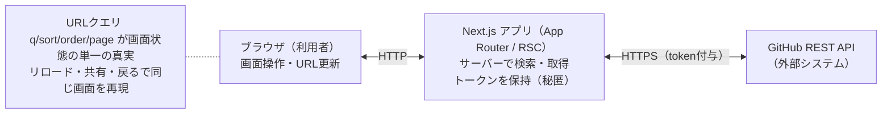
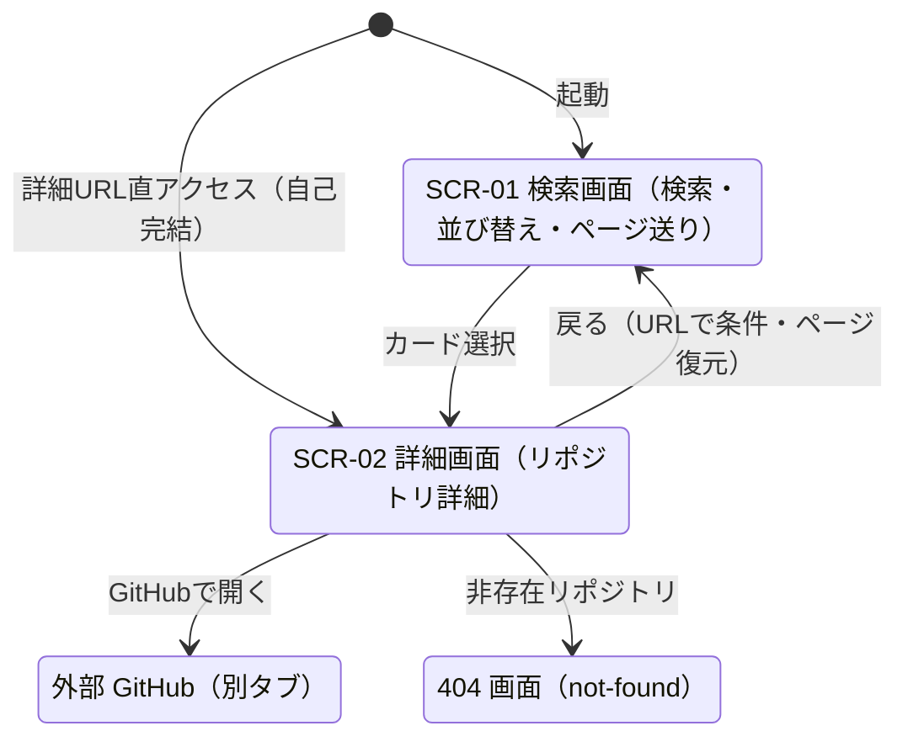

# 基本設計書(外部設計)

>システムを「外から見た仕様」を定義する。画面・機能・外部インターフェース・データを、利用者と外部システムの視点で示す。
>内部の作り（コンポーネント分解・内部ロジック）は詳細設計書（DETAIL_DESIGN.md）に委ねる。

## 1. システム概要

Githubの公開リポジトリをキーワードで検索し、結果一覧と各リポジトリの詳細を閲覧するWebアプリケーション

- User : リポジトリを探す開発者
- DataSource : Github REST API(外部システム) 本システムでは独自のデータストアは持たない
- Form : Next.js(App Router)によるサーバーレンダリング型Webアプリ

### 1.1 スコープ

REQUIREMENTS.md参照

#### やること

- キーワード検索
- 結果一覧
- 並び替え
- ページ送り
- リポジトリ詳細表示
- GitHubページへの外部リンク
- テーマ切替（ダーク/ライト）

#### やらないこと

- 認証ログイン
- 無限スクロール
- データ永続化

---

## 2. システム構成

### 2.1 構成図（論理）

### 2.2 構成上の方針

- データ取得・Githubトークンの保持は全てNext.jsサーバー側で行い、トークンをブラウザに露出しない。
- ブラウザは画面操作とURL更新を担う。画面の状態はURLクエリで表現する。
- テーマ（ダーク/ライト）と一覧の表示形式（リスト/グリッド）は個人の表示設定であり共有対象ではないため、URLではなくクライアント側（localStorage）に保持する。
- 外部システム（Github API） への依存はシステム内の境界層に閉じる。

---

### 3. 機能一覧

詳細はREQUIREMENTS.mdを参照する

- キーワード検索
- 検索状態のURL保持
- 結果一覧表示
- 並び替え
- ページ送り
- 詳細表示
- 外部リンク
- 状態表示
- テーマ切替（ダーク/ライトモード）

---

## 4. 画面一覧

| 画面ID | 画面名 | URL | 概要 |
| --- | --- | --- | --- |
| SCR-01 | 検索画面 | `/?q=&sort=&order=&page=` | 検索・一覧・並び替え・ページ送り |
| SCR-02 | 詳細画面 | `/repositories/[owner]/[repo]` | リポジトリ詳細の表示 |

※ 全画面共通でヘッダにテーマ切替トグルを持つ（新規画面は増えない）。

---

## 5. 画面遷移

### 5.1 画面遷移図

### 5.2 遷移仕様

| 遷移元 | 操作 | 遷移先 | 備考 |
| --- | --- | --- | --- |
| SCR-01 | カード選択 | SCR-02 | `owner`/`repo` をパスに付与 |
| SCR-02 | 戻る | SCR-01 | URLで検索条件・ページを復元 |
| SCR-02 | GitHubで開く | 外部(GitHub) | 別タブ・`rel="noopener noreferrer"` |
| 任意 | 詳細URL直アクセス | SCR-02 | 自己完結（サーバーで再取得） |
| SCR-02 | 非存在リポジトリ | 404画面 | `not-found` |

---

## 6. 外部インターフェース設計

外部システムは GitHub REST API のみ。詳細は GITHUB_API.md を参照し、本書は利用範囲の一覧を示す。

| 用途 | エンドポイント | 主な入力 | 主な出力 |
| --- | --- | --- | --- |
| 検索 | `GET /search/repositories` | `q`, `sort`, `order`, `page`, `per_page` | `total_count`, `items[]` |
| 詳細取得 | `GET /repos/{owner}/{repo}` | `owner`, `repo` | リポジトリ詳細（`subscribers_count` 含む） |

- 認証: サーバー保持のトークンを `Authorization` ヘッダで付与（秘匿）。
- 制約: 検索は最大1,000件・検索系30req/分（認証時）。`q` は256文字・演算子5個まで。
- 異常系: 403/429（レート制限）, 404（非存在）, 422（クエリ不正）を型付きで扱う。

---

## 9. 非機能設計（概要）

詳細は REQUIREMENTS.md 非機能要件。本書では外部から見た方針のみ示す。

| 区分 | 方針 |
| --- | --- |
| 性能 | RSCで初期JS最小化・スケルトン表示・画像最適化 |
| 信頼性 | API障害/レート制限時はフォールバック表示＋再試行 |
| セキュリティ | トークンはサーバー秘匿。外部URLはスキーム検証。XSSはReact自動エスケープに委ね危険APIを使わない |
| 使用性 | WCAG 2.1 AA目安・キーボード完結・レスポンシブ・ライト/ダーク双方でコントラスト基準を満たす |
| 互換性 | Next.js 16サポート範囲のモダンブラウザ（IE非対象） |

---
