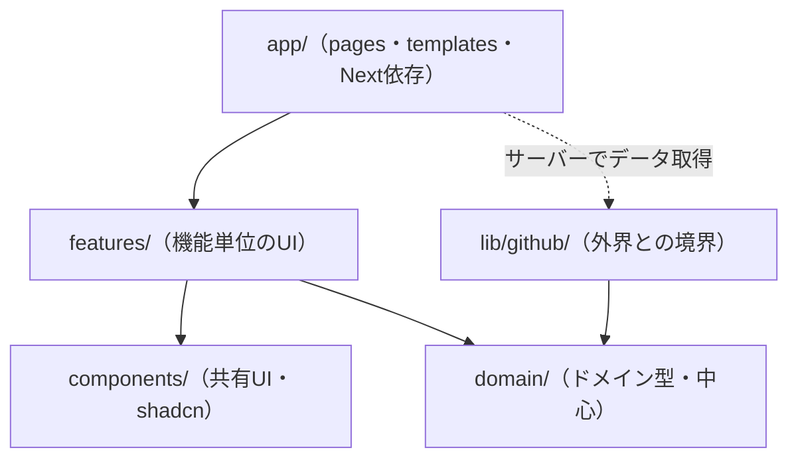
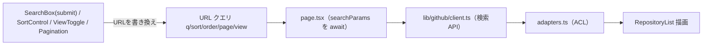

# 詳細設計書 (画面・機能)

> 内部の作り（コンポーネント分解・内部ロジック・データフロー・型）を定義する。
> 要件は REQUIREMENTS.md、外部仕様（画面遷移・I/F）は基本設計書、API仕様は GITHUB_API.md を参照。
> 章立ては REQUIREMENTS.md の機能要件（§3）に対応させる。

---

## 1. 全体構成

### 1.1 ディレクトリ構成（機能軸＋コロケーション）

> 機能（feature）単位で凝集させ、関連するもの（コンポーネント・型・テスト）を近くに置く（コロケーション）。
> 複数機能で共有するプリミティブだけを共通の場所（`components/`）へ引き上げる。
> 設計思想は UI_DESIGN_PHILOSOPHY.md / DESIGN_PHILOSOPHY.md §8 を参照。

```text
src/
  app/                          # ルーティング/レイアウト（Next規約）。薄く保つ
    layout.tsx                  # 全体骨格＋ThemeProvider
    page.tsx                    # 検索画面（featureのorganismを組む・RSC）
    loading.tsx
    error.tsx                   # Client Component
    repositories/
      [owner]/
        [repo]/
          page.tsx              # 詳細画面（RSC）
          loading.tsx
          not-found.tsx
  features/                     # 機能単位で凝集（変更が1フォルダに収まる）
    repository-search/
      components/
        search-box.tsx          # client（submit方式）
        sort-control.tsx        # client
        view-toggle.tsx         # client（リスト/グリッド切替）
        pagination.tsx          # client
        results-header.tsx      # client（件数＋sort＋view＋theme を束ねる）
        repository-list.tsx     # 一覧（RSCから渡されたデータを描画）
        repository-card.tsx     # 表示のみ
        empty-state.tsx
      __tests__/                # この機能のテストをコロケーション
    repository-detail/
      components/
        repository-detail.tsx
        stat-badge.tsx
        external-link.tsx
      __tests__/
  components/                   # 複数機能で共有する汎用UIのみ
    ui/                         # shadcn/ui（コピーして所有・改変）
    theme/
      theme-provider.tsx        # next-themes のラッパ（layoutで使用）
      theme-toggle.tsx          # client（ダーク/ライト切替）
  domain/                       # ドメイン層・中心（UI設計思想の対象外）
    repository.ts               # ドメイン型（Nextに非依存）
  lib/                          # インフラ層（UI設計思想の対象外）
    github/
      client.ts                 # fetchラッパ（infra・トークン付与・エラー変換）
      adapters.ts               # ACL: raw → domain（純粋関数）
      types.ts                  # GitHub生レスポンス型
      errors.ts                 # 型付きエラー
  hooks/                        # 任意: 複数機能で共有する横断ロジック
  test/
    setup.ts
    msw/{handlers.ts, server.ts}
```

**配置の判断基準**:

| 置き場所 | 何を置くか |
| --- | --- |
| `features/<機能>/` | その機能でしか使わないコンポーネント・型・テスト（コロケーション） |
| `components/ui/` | 複数機能で共有する汎用プリミティブ（shadcn/ui） |
| `components/theme/` | アプリ全体で使うテーマ関連 |
| `domain/` `lib/` | UI 層の外（ドメイン型・インフラ・ACL） |

- **原則1（コロケーション）**: 変更は機能単位で起きる。機能に固有のものは機能フォルダに集約し、変更が1フォルダに収まるようにする。
- **原則2（共有は引き上げ）**: 2つ以上の機能で使うものだけ `components/` へ上げる。最初から共通化しない（必要になってから）。
- **原則3（合成）**: 小さく単純な部品を組み合わせて作る（React/shadcn の合成思想）。粒度の分類フォルダ（atoms/molecules等）は作らない。
- **種別**: 対話が必要な葉にのみ `"use client"`。データ取得は `app/` の RSC が行い、`features` の表示部品へ props で渡す（UI層はAPIを直接叩かない）。

### 1.2 依存方向



- 依存は内側（domain）へ向ける。ビジネスロジックは `lib`/`domain` に置き Next を import しない（要件 §4.3）。
- データ取得は `app/`（RSC）が `lib/github` を呼び、結果を `features` の表示部品へ props で渡す。UI層はAPIを直接叩かない。
- 外界（GitHub API）は `lib/github` に閉じる（要件 §4.6）。

---

## 2. 検索画面（SCR-01）

要件 §3.1（検索）・§3.2（一覧表示）・§3.4（状態表示）・§3.5（テーマ）に対応。

### 2.1 コンポーネント分解

| コンポーネント | 種別 | 役割 | 対応要件 |
| --- | --- | --- | --- |
| `SearchBox` | Client | キーワード入力 → submitでURL `?q=` 更新 | §3.1 |
| `SortControl` | Client | 並び替え → URL `?sort=&order=` 更新 | §3.1 |
| `ViewToggle` | Client | リスト/グリッド切替 → URL `?view=` 更新 | §3.2 |
| `ThemeToggle` | Client | ダーク/ライト切替（アプリ全体） | §3.5 |
| `ResultsHeader` | Client | 件数表示＋Sort＋View＋Theme を束ねる | §3.1, §3.2, §3.5 |
| `RepositoryList` | Server | 検索API実行・結果をリスト/グリッドで描画 | §3.2 |
| `RepositoryCard` | Server | 1件分の表示（レイアウト非依存） | §3.2 |
| `Pagination` | Client | ページ送り → URL `?page=` 更新 | §3.2 |
| `EmptyState` | Server | 0件表示 | §3.4 |

### 2.2 SearchBox（検索ボックス・submit方式）

- 役割: 入力を受け、**送信時に**URLの `q` を更新する。データ取得はしない（URL更新のみ）。
- 振る舞い:
  - `<form>` の送信（検索ボタンのクリック または Enter）で `?q=` を更新する。
  - **打鍵ごとの自動検索（デバウンス）は行わない**（要件 §3.1）。
  - 送信時、空文字・空白のみは無効（検索を実行しない）。
  - 入力クリアボタン（×）を持つ（入力中のみ表示）。
  - URL更新は `useTransition` でラップし、検索中も `isPending` で進行を示す。
- 状態: 入力中テキストはコンポーネントローカル `useState`。確定値（送信後）はURL。
- 補足: URL更新は `router.push`（検索は意図的な操作なので履歴に残してよい）。ページ番号は新規検索時に1へ。

### 2.3 SortControl（並び替え）

- 項目: 関連度（デフォルト）/ Star数 / Fork数 / 更新日時（要件 §3.1）。
- 内部値: 関連度=`sort`未指定 / `stars` / `forks` / `updated`。`order` 既定 `desc`。
- **名前順・Issue数順は採用しない**（GitHub APIの`sort`に無い／意味が異なるため。GITHUB_API.md §4.1）。モックの選択肢ではなくAPI準拠を正とする。
- 振る舞い: 変更で `?sort=&order=` 更新、同時に `page=1` リセット（§4.4）。サーバーソート（API委譲）。
- UI: **shadcn/ui の Select** を使用（キーボード操作・フォーカス・ARIA が土台で確保される）。見た目はモック参照でデザイントークンに合わせて改変する。

### 2.4 ViewToggle（リスト/グリッド切替）

- 役割: 一覧の表示形式を切替（要件 §3.2）。
- 状態の置き場所: **URL `?view=list|grid`**（リロード・共有で再現。URL-as-stateと一貫）。既定はリスト。
- 補足: 表示形式の違いは**レイアウトのみ**。`RepositoryList` がコンテナのCSS（リスト/グリッド）を切替、`RepositoryCard` は表示専用でレイアウト非依存。

### 2.5 ThemeToggle（ダーク/ライト切替）

- 役割: アプリ全体のテーマを切り替える（要件 §3.5）。
- 配置: トグルUIは `ResultsHeader`（またはアプリ共通ヘッダ）。提供は `app/layout.tsx` の `ThemeProvider`。
- 状態の置き場所: **localStorage**（個人の表示設定で共有対象でないため。検索条件＝URL、テーマ＝localStorage という使い分け）。
- 初期値: OSの `prefers-color-scheme` に追従。
- FOUC対策（重要）: SSRでは初回描画時にテーマがちらつく。**`next-themes` を採用**してFOUC・システム追従・localStorage永続を解決する（TECH_STACK.md。ダークモードのための正当な依存）。`ThemeProvider` は `next-themes` のラッパとして `app/layout.tsx` に置く。
- 実装: `next-themes` が `<html>` に class/属性（`.dark` 等）を付与し、CSS変数（`--surface` `--text` `--border` 等）をライト/ダークで切り替える。shadcn/ui のテーマ変数規約に合わせる。

### 2.6 RepositoryList / RepositoryCard

- `RepositoryList`: サーバーで `GET /search/repositories?q=&sort=&order=&page=&per_page=30`。`view` に応じてリスト/グリッドのレイアウト切替。リスト構造でマークアップ（§4.4）。
- `RepositoryCard`: 表示項目＝リポジトリ名・オーナー・アイコン（`next/image`・alt=オーナー名）・言語（null時「言語情報なし」）・Star数（compact表記）・説明（欠落時も崩さない）。カード全体を `Link` で詳細へ。キーボード遷移可。

### 2.7 Pagination

- `?page=` 更新、`q`/`sort`/`order`/`view` 保持。現在ページ番号＋前後リンク。検索1000件上限でクランプ（`per_page=30` で最大34ページ）。

### 2.8 状態（要件 §3.4）

| 状態 | 条件 | 表示 | 実装 |
| --- | --- | --- | --- |
| 初期 | `q` 未指定 | 検索を促すプレースホルダ | 一覧を描画しない |
| ローディング | フェッチ中 / 遷移中 | スケルトン | `loading.tsx` + `isPending` |
| 空 | `total_count === 0` | 「該当なし」 | `EmptyState` |
| エラー | API失敗 | メッセージ＋再試行 | `error.tsx` |
| 正常 | 結果あり | リスト/グリッド | `RepositoryList` |

### 2.9 データフロー



入力系は URL を書き換えるだけ。書き換えると `page.tsx` が再実行され、取得→変換→描画が再走する。テーマはこの流れと独立（クライアントのみ）。

---

## 3. 詳細画面（SCR-02）

要件 §3.3（詳細表示）・§3.4（状態表示）に対応。

### 3.1 コンポーネント分解

| コンポーネント | 種別 | 役割 |
| --- | --- | --- |
| `BackLink` | Server | 検索結果へ戻る |
| `RepositoryDetail` | Server | アイコン・名前・言語 |
| `StatBadge` ×4 | Server | Star/Watcher/Fork/Issue |
| `ExternalLink` | Server | GitHubで開く |

### 3.2 データ取得

- エンドポイント: `GET /repos/{owner}/{repo}`（検索結果を使い回さない）。
- 理由: 真のWatcher数 `subscribers_count` は検索結果に含まれない場合があるため、詳細エンドポイントで確実に取得（GITHUB_API.md §6）。詳細画面が一覧に依存しない自己完結ページになる。
- キャッシュ: 詳細は鮮度要求が低いため短命キャッシュ可（要件 §4.1）。

### 3.3 表示7項目（要件 §3.3）

| 項目 | フィールド | 表示 |
| --- | --- | --- |
| リポジトリ名 | `full_name` | テキスト |
| オーナーアイコン | `owner.avatar_url` | `next/image`・alt=オーナー名 |
| 言語 | `language` | null時「言語情報なし」 |
| Star数 | `stargazers_count` | StatBadge・compact |
| Watcher数 | **`subscribers_count`** | StatBadge |
| Fork数 | `forks_count` | StatBadge |
| Issue数 | `open_issues_count` | StatBadge |

- **スコープ注記**: モックのDetailViewにあるREADME本文・言語内訳バー・ライセンス・トピックは今回スコープ外（要件 §5）。上記7項目に絞る。
- **重要**: モックは詳細を状態切替で表示しているが、本実装は**ページ遷移（ルート）**で実装する（要件 §3.3・基本設計）。モックのナビゲーション方式は流用しない。

### 3.4 StatBadge / ExternalLink

- StatBadge: アイコン＋数値＋ラベル。アイコンのみにせずアクセシブルな名前（"Stars: 1,234"）を持つ（§4.4）。数値は `Intl.NumberFormat`（compact）。
- ExternalLink: `html_url` を使用。新規タブの場合 `target="_blank"` + `rel="noopener noreferrer"`。文言は「GitHubで開く」。`html_url` はアダプタ層で `http`/`https` スキーム検証済み（§4.5）。

### 3.5 状態（要件 §3.4）

| 状態 | 条件 | 表示 | 実装 |
| --- | --- | --- | --- |
| ローディング | フェッチ中 | スケルトン | `loading.tsx` |
| 404 | 非存在 | Not Found | `notFound()` → `not-found.tsx` |
| エラー | その他失敗 | メッセージ＋戻る | `error.tsx` |
| 正常 | 成功 | 詳細 | `RepositoryDetail` |

### 3.6 メタデータ（加点・任意）

- `generateMetadata` でリポジトリ名・説明から動的にタイトル/OGPを生成。

---

## 4. 機能横断の内部設計

### 4.1 GitHub APIクライアント（`lib/github/client.ts`）

- 責務: fetchラッパ。ヘッダ（`Accept`/`Authorization`/`X-GitHub-Api-Version`）、トークン付与、ステータス→型付きエラー変換。
- トークン: サーバー環境変数（§4.5）。未設定時は認証なしで続行（制限が厳しい旨を示す）。
- エラー変換: 403/429→`RateLimitError`、404→`NotFoundError`、422→`ValidationError`、その他→`GitHubApiError`。

### 4.2 アダプタ（`lib/github/adapters.ts` / ACL）

- 純粋関数: `toRepository(raw)`、`toRepositoryDetail(raw)`（`watchers = raw.subscribers_count`）。
- エッジケース: `language: null` 保持 / URLフィールドの `http`/`https` スキーム検証 / 数値欠損は0フォールバック。

### 4.3 ドメイン型（`domain/repository.ts`）

```ts
type Repository = {
  id: number;
  fullName: string;
  owner: string;
  repo: string;
  ownerAvatarUrl: string;
  language: string | null;
  stars: number;
  description: string | null;
};

type RepositoryDetail = Repository & {
  watchers: number;   // subscribers_count 由来
  forks: number;
  openIssues: number;
  htmlUrl: string;
};
```

### 4.4 状態の同期ルール（横断）

| 状態 | 置き場所 | 操作時のpage |
| --- | --- | --- |
| キーワード `q` | URL | 1にリセット |
| ソート `sort`/`order` | URL | 1にリセット |
| ページ `page` | URL | 変更 |
| 表示形式 `view` | URL | 維持 |
| テーマ | **localStorage** | 影響なし |

- URL更新: 検索の確定は `router.push`、それ以外（sort/view/page）は `router.replace`。
- テーマのみURLではなくlocalStorage（共有対象でない個人設定のため）。

### 4.5 検索クエリ構築

- `q` は `encodeURIComponent`（§4.5、GITHUB_API.md §4.2）。256文字・演算子5個の制限超過は 422 → `ValidationError`。

### 4.6 shadcn/ui コンポーネント割り当て

shadcn/ui を土台に使い、デザイントークン・アニメーションは自力で乗せる（TECH_STACK.md）。

| 部品 | 配置先 | shadcn/ui | 用途 | 自力で足すもの |
| --- | --- | --- | --- | --- |
| SearchBox | repository-search | Input + Button | キーワード入力＋送信 | 検索アイコン・クリア(×)・フォーカス装飾 |
| SortControl | repository-search | Select | 並び替え選択 | デザイントークン適用 |
| ViewToggle | repository-search | ToggleGroup | リスト/グリッド切替 | アイコン・セグメント装飾 |
| ThemeToggle | components/theme | Button（+ next-themes） | ダーク/ライト切替 | 太陽/月アイコン・トランジション |
| RepositoryCard | repository-search | Card | 結果カード | アバター(グラデ生成)・hover浮き・アクセントエッジ・float-in |
| StatBadge | repository-detail | （自前 or Card内要素） | 統計表示 | アイコン・CountUpアニメ |
| ローディング | 各機能 | Skeleton | スケルトン表示 | shimmer調整 |
| エラー表示 | 各機能 | Alert | エラーメッセージ | 文言・再試行ボタン |

- 原則: shadcnは「構造とa11y」、自力部分は「デザインの個性」。モックのコードは流用せず見た目のみ参照する。

---

## 5. テスト詳細設計（要件 §3.6）

方針: テストは4層（①ユニット / ②コンポーネント / ③結合 / ④E2E）に分け、各層の保証対象で役割分担する（TEST_PHILOSOPHY.md §1）。配分はテスティングトロフィー（③最厚）。表示コンポーネントは props のみ受け取る純粋な部品にしてテスト容易性を確保。

| 層 | テスト | 対象 | 内容 |
|---|---|---|---|
| ① | アダプタ単体テスト（要件 §3.6） | `adapters.ts` | 変換・`language:null`・`watchers=subscribers_count`・URLスキーム検証・数値欠損 |
| ① | format単体テスト | `format.ts` | compact表記・境界値 |
| ②/③ | クライアントエラーの写像（要件 §3.6） | `client.ts` | MSWで403/404/422→型付きエラー |
| ② | コンポーネントテスト | RepositoryCard / Pagination / SearchBox / 詳細系 | 表示の契約（null表示・フォールバック・表示条件・無効化・空送信無効） |
| ③ | 検索フロー結合テスト（要件 §3.6） | 検索画面 | submit→結果 / 0件→空 / 403→エラー / pageリセット / view切替 |
| ③ | ソート統合テスト（要件 §3.6） | SortControl + URL | `sort`/`order`反映・URL同期・page リセット |
| ②/③ | 詳細描画テスト（要件 §3.6） | 詳細画面 | 7項目・a11y・外部リンク（`href`/`rel`） |
| ④ | E2E（任意・提出前） | アプリ全体（実ブラウザ） | ハッピーパス1本（検索→結果→詳細→7項目） |

補足: テーマ切替は、トグルで `<html>` のテーマ属性が変わること・localStorageに保持されることを軽くテストに含める（任意）。

---

## 6. 要件トレーサビリティ（要件章 → 実装箇所）

| 要件（REQUIREMENTS.md） | 実装箇所 |
| --- | --- |
| §3.1 検索 | SearchBox（submit）/ SortControl |
| §3.2 一覧表示 | RepositoryList / RepositoryCard / ViewToggle / Pagination |
| §3.3 詳細表示 | RepositoryDetail / StatBadge / ExternalLink / 詳細データ取得 |
| §3.4 状態表示 | loading.tsx / error.tsx / not-found.tsx / EmptyState |
| §3.5 テーマ切替 | ThemeProvider / ThemeToggle |
| §3.6 テスト | §5 テスト詳細設計 |
| §4.3 保守性 | アダプタ(ACL) / 機能単位ディレクトリ / domain分離 |
| §4.5 セキュリティ | トークン付与 / クエリエンコード / URLスキーム検証 |
