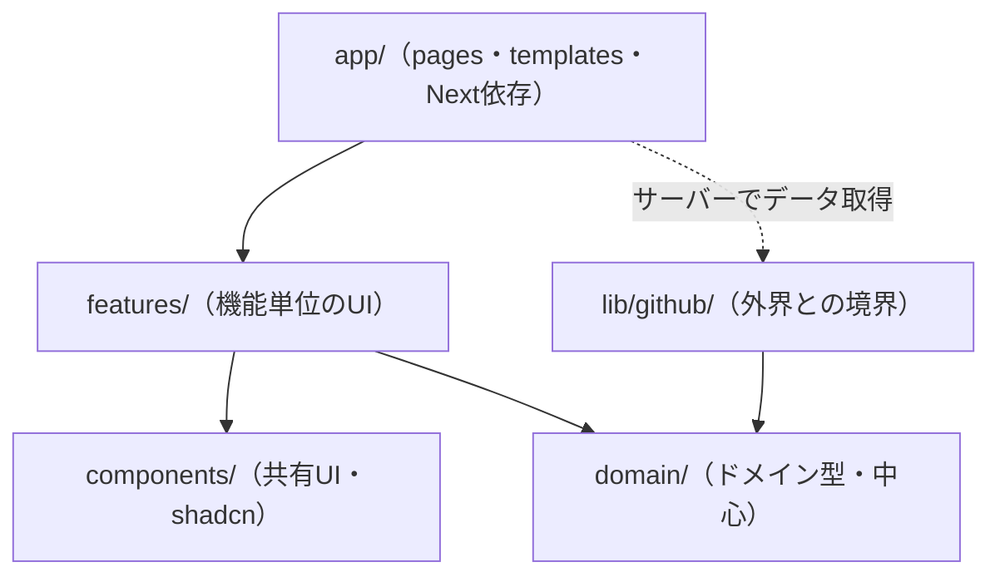
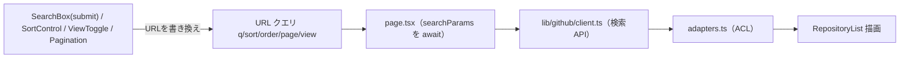

# 詳細設計書 (画面・機能)

> 内部の作り（コンポーネント分解・内部ロジック・データフロー・型）を定義する。
> 要件は REQUIREMENTS.md、外部仕様（画面遷移・I/F）は基本設計書、API仕様は GITHUB_API.md を参照。
> 章立ては REQUIREMENTS.md の機能要件（§3）に対応させる。

---

## 1. 全体構成

### 1.1 ディレクトリ構成（機能軸＋コロケーション）

> 機能（feature）単位で凝集させ、関連するもの（コンポーネント・型・テスト）を近くに置く（コロケーション）。
> 複数機能で共有するプリミティブだけを共通の場所（`components/`）へ引き上げる。
> 設計思想は UI_DESIGN_PHILOSOPHY.md / DESIGN_PHILOSOPHY.md §8 を参照。

```
src/
  app/                          # ルーティング/レイアウト（Next規約）。薄く保つ
    layout.tsx                  # 全体骨格＋ThemeProvider
    page.tsx                    # 検索画面（featureのUIを組む・RSC）
    loading.tsx
    error.tsx                   # Client Component
    repositories/
      [owner]/
        [repo]/
          page.tsx              # 詳細画面（RSC）
          loading.tsx
          not-found.tsx
  features/                     # ★ 機能単位で凝集（変更が1フォルダに収まる）
    repository-search/
      components/
        search-box.tsx          # client（submit方式）
        search-box.test.tsx
        sort-control.tsx        # client
        sort-control.test.tsx
        view-toggle.tsx         # client（リスト/グリッド切替・セグメント表示）
        view-toggle.test.tsx
        pagination.tsx          # client（数字ピル＋前後矢印・ウィンドウ表示）
        pagination.test.tsx
        results-view.tsx        # client（件数(CountUp)＋sort＋view を束ね、FLIPを担当）※束ね役・単体テストなし
        repository-list.tsx     # client（リスト/グリッドのコンテナ）※mapのみ・単体テストなし
        repository-card.tsx     # 表示のみ（list/grid 2バリアント）
        repository-card.test.tsx
        search-results.tsx      # RSC（検索API実行→一覧描画。結合テストの入口）
        empty-state.tsx         # 結果0件表示・単体テストなし
        empty-state.test.tsx
        search-prompt-state.tsx # 検索前の促し表示・単体テストなし
        search-skeleton.tsx     # ローディング（shimmer）・単体テストなし
      search-flow.test.tsx      # ③結合: 部品をまたぐテストは機能フォルダ直下
    repository-detail/
      components/
        repository-detail.tsx
        repository-detail.test.tsx
        stat-card.tsx           # スタットカード（アイコン＋CountUp＋ラベル）
        external-link.tsx       # GitHubで開く（rel属性＝セキュリティの契約）
      detail-flow.test.tsx      # ③結合: 詳細描画・a11y
  components/                   # 複数機能で共有する汎用UIのみ
    ui/                         # shadcn/ui（コピーして所有・改変）
    layout/
      site-header.tsx           # 全ルート共通ヘッダー（ロゴ＋テーマ切替）
      site-footer.tsx           # 全ルート共通フッター
      motion-ready.tsx          # client（描画後に <html>.motion-ready 付与）
    theme/
      theme-provider.tsx        # next-themes のラッパ（layoutで使用）
      theme-toggle.tsx          # client（ダーク/ライト切替・View Transitions 円形リビール）
      theme-toggle.test.tsx     # テーマ属性の切替・localStorage保持
    count-up.tsx                # client（数値カウントアップ・共有）
    language-dot.tsx            # 言語色ドット＋言語名（共有）
    repo-avatar.tsx             # オーナーアバター（next/image＋頭文字フォールバック）
  domain/                       # ドメイン層・中心（UI設計思想の対象外）
    repository.ts               # ドメイン型（Nextに非依存）
  lib/                          # インフラ層（UI設計思想の対象外）
    format.ts                   # 数値compact表記・日付整形
    format.test.ts
    language-color.ts           # 言語→色（linguist準拠）
    language-color.test.ts
    utils.ts                    # shadcn生成（cn）
    github/
      client.ts                 # fetchラッパ（infra・トークン付与・エラー変換）
      client.test.ts
      adapters.ts               # ACL: raw → domain（純粋関数）
      adapters.test.ts
      types.ts                  # GitHub生レスポンス型
      errors.ts                 # 型付きエラー
  hooks/                        # 任意: 複数機能で共有する横断ロジック
  test/                         # テスト基盤（横断）
    setup.ts
    msw/{handlers.ts, server.ts}
e2e/                            # ④E2E（Playwright・導入時）
  happy-path.spec.ts            # 検索→結果→詳細→7項目
```

**テストを書かないファイル（意図的）**: `results-header`（束ねるだけ）・`repository-list`（mapのみ）・`empty-state`（静的表示）は、②の保証対象「UIの責務」が薄いため単体テストを書かず、③結合テストの通過点としてカバーする（カバレッジを目的にしない・TEST_PHILOSOPHY.md §6）。`errors.ts`・`types.ts`・`domain/repository.ts` は型/定義のみのためテスト対象外（静的解析が保証）。

**配置の判断基準**:

| 置き場所 | 何を置くか |
|---|---|
| `features/<機能>/` | その機能でしか使わないコンポーネント・型・テスト（コロケーション） |
| `components/ui/` | 複数機能で共有する汎用プリミティブ（shadcn/ui） |
| `components/theme/` | アプリ全体で使うテーマ関連 |
| `domain/` `lib/` | UI 層の外（ドメイン型・インフラ・ACL） |

**テストファイルの配置（同階層方式）**:

| テストの種類 | 置き場所 | 例 |
|---|---|---|
| 対象が明確（①ユニット・②コンポーネント） | **対象ファイルの真隣**（`*.test.ts(x)`） | `repository-card.test.tsx` |
| 部品をまたぐ（③結合） | 機能フォルダ直下 | `features/repository-search/search-flow.test.tsx` |
| テスト基盤（setup・MSW雛形） | `src/test/` | `src/test/msw/server.ts` |
| ④E2E | 専用フォルダ（導入時に `e2e/`） | `e2e/happy-path.spec.ts` |

- 同階層を選ぶ理由: **テストの有無が一目で分かり、テストのし忘れを防げる**（テストが無い部品は隣が空いている）。対象のリネーム・削除時にテストが視界に入り、孤児テストを生まない。テストを仕様書として実装とセットで読める（TEST_PHILOSOPHY.md §9）。
- `__tests__/` フォルダへの集約は採用しない（`components/` の一覧性は上がるが、テスト有無の可視性と対応関係の維持を優先）。lib層・features層で配置規則を1つに統一する。

- **原則1（コロケーション）**: 変更は機能単位で起きる。機能に固有のものは機能フォルダに集約し、変更が1フォルダに収まるようにする。
- **原則2（共有は引き上げ）**: 2つ以上の機能で使うものだけ `components/` へ上げる。最初から共通化しない（必要になってから）。
- **原則3（合成）**: 小さく単純な部品を組み合わせて作る（React/shadcn の合成思想）。
- **種別**: 対話が必要な葉にのみ `"use client"`。データ取得は `app/` の RSC が行い、`features` の表示部品へ props で渡す（UI層はAPIを直接叩かない）。

### 1.2 依存方向



- 依存は内側（domain）へ向ける。ビジネスロジックは `lib`/`domain` に置き Next を import しない（要件 §4.3）。
- データ取得は `app/`（RSC）が `lib/github` を呼び、結果を `features` の表示部品へ props で渡す。UI層はAPIを直接叩かない。
- 外界（GitHub API）は `lib/github` に閉じる（要件 §4.6）。

---

## 2. 検索画面（SCR-01）

要件 §3.1（検索）・§3.2（一覧表示）・§3.4（状態表示）・§3.5（テーマ）に対応。

### 2.1 コンポーネント分解

| コンポーネント | 種別 | 役割 | 対応要件 |
|---|---|---|---|
| `SearchBox` | Client | キーワード入力 → submitでURL `?q=` 更新 | §3.1 |
| `SortControl` | Client | 並び替え → URL `?sort=&order=` 更新 | §3.1 |
| `ViewToggle` | Client | リスト/グリッド切替 → localStorage（個人設定） | §3.2 |
| `ThemeToggle` | Client | ダーク/ライト切替（アプリ全体・円形リビール） | §3.5 |
| `ResultsView` | Client | 件数(CountUp)＋Sort＋View を束ね、FLIP を担当 | §3.1, §3.2 |
| `RepositoryList` | Client | 結果をリスト/グリッドで並べる（FLIP対象のコンテナ） | §3.2 |
| `RepositoryCard` | Server | 1件分の表示（list/grid 2バリアント） | §3.2 |
| `Pagination` | Client | ページ送り → URL `?page=` 更新（数字ピル） | §3.2 |
| `EmptyState` / `SearchPromptState` | Server | 0件表示 / 検索前の促し表示 | §3.4 |

> ヘッダー（ロゴ＋`ThemeToggle`）・フッター・ドット背景は `app/layout.tsx` に置き全ルート共通。検索画面上部にはヒーロー（バッジ＋グラデ見出し＋サブコピー）を持つ。

### 2.2 SearchBox（検索ボックス・submit方式）

- 役割: 入力を受け、**送信時に**URLの `q` を更新する。データ取得はしない（URL更新のみ）。
- 振る舞い:
  - `<form>` の送信（検索ボタンのクリック または Enter）で `?q=` を更新する。
  - **打鍵ごとの自動検索（デバウンス）は行わない**（要件 §3.1）。
  - 送信時、空文字・空白のみは無効（検索を実行しない）。
  - 入力クリアボタン（×）を持つ（入力中のみ表示）。
  - URL更新は `useTransition` でラップし、検索中も `isPending` で進行を示す。
- 状態: 入力中テキストはコンポーネントローカル `useState`。確定値（送信後）はURL。
- 補足: URL更新は `router.push`（検索は意図的な操作なので履歴に残してよい）。ページ番号は新規検索時に1へ。

### 2.3 SortControl（並び替え）

- 項目: 関連度（デフォルト）/ Star数 / Fork数 / 更新日時（要件 §3.1）。
- 内部値: 関連度=`sort`未指定 / `stars` / `forks` / `updated`。`order` 既定 `desc`。
- **名前順・Issue数順は採用しない**（GitHub APIの`sort`に無い／意味が異なるため。GITHUB_API.md §4.1）。モックの選択肢ではなくAPI準拠を正とする。
- 振る舞い: 変更で `?sort=&order=` 更新、同時に `page=1` リセット（§4.4）。サーバーソート（API委譲）。
- UI: **shadcn/ui の Select** を使用（キーボード操作・フォーカス・ARIA が土台で確保される）。見た目はモック参照でデザイントークンに合わせて改変する。

### 2.4 ViewToggle（リスト/グリッド切替）

- 役割: 一覧の表示形式を切替（要件 §3.2）。
- 状態の置き場所: **クライアント状態（useState）＋ localStorage 永続**（キー `repo-finder:view`）。テーマと同じ「個人の表示設定」の扱い。
  - **当初は URL `?view=` に置いたが変更した**。判断基準を精緻化した結果: URL に載せるのは「共有・再現すべき結果の状態」（q/sort/order/page）であり、view は閲覧者個人の見え方の好みで共有対象ではない（テーマと同類）。リロード保持は localStorage で満たせる。
  - 副次効果: view 変更がクライアント内で完結し、サーバーフェッチや URL 遷移を一切伴わない（切替が即時・アニメーションと確実に同期）。
- 構成: `ResultsView`（client）が view の state と永続を一元管理し、`ViewToggle`（props in / callback out の純粋部品）と `RepositoryList` を束ねる。SortControl など URL 系の操作はサーバー側（SearchResults）に残り、**URL 系とローカル系の操作がコンポーネント構造上も分離**される。
- SSR 整合: 初期レンダリングは常に list（サーバーは localStorage を知らないため）。マウント後に保存値を反映する。テーマと異なり一瞬 list が見えても実害がないため、ライブラリ級の FOUC 対策は不要と判断。
- 補足: 表示形式の違いは**レイアウトのみ**。`RepositoryList` がコンテナのCSS（リスト/グリッド）を切替、`RepositoryCard` は list/grid バリアントを props で描き分ける。切替時は `ResultsView` が **FLIP**（前後位置を計測し WAAPI でトゥイーン）で滑らかに並び替える。カードノードは切替で再マウントしない（同一ノードを動かす）。各 `<li>` の出現アニメーション（floatIn stagger）は初回マウント時に再生。

### 2.5 ThemeToggle（ダーク/ライト切替）

- 役割: アプリ全体のテーマを切り替える（要件 §3.5）。
- 配置: トグルUIは `ResultsHeader`（またはアプリ共通ヘッダ）。提供は `app/layout.tsx` の `ThemeProvider`。
- 状態の置き場所: **localStorage**（個人の表示設定で共有対象でないため。検索条件＝URL、テーマ＝localStorage という使い分け）。
- 初期値: OSの `prefers-color-scheme` に追従。
- FOUC対策（重要）: SSRでは初回描画時にテーマがちらつく。**`next-themes` を採用**してFOUC・システム追従・localStorage永続を解決する（TECH_STACK.md。ダークモードのための正当な依存）。`ThemeProvider` は `next-themes` のラッパとして `app/layout.tsx` に置く。
- 実装: `next-themes` が `<html>` に class/属性（`.dark` 等）を付与し、CSS変数（`--surface` `--text` `--border` 等）をライト/ダークで切り替える。shadcn/ui のテーマ変数規約に合わせる。

### 2.6 RepositoryList / RepositoryCard

- `RepositoryList`: サーバーで `GET /search/repositories?q=&sort=&order=&page=&per_page=30`。`view` に応じてリスト/グリッドのレイアウト切替。リスト構造でマークアップ（§4.4）。
- `RepositoryCard`: 表示項目＝オーナー / リポジトリ名・アイコン（`RepoAvatar`＝`next/image`・alt=オーナー名、欠落時は頭文字）・言語ドット（null時「言語情報なし」）・Star / Fork / Issue 数（compact表記）・説明（欠落時も崩さない）。グリッド時はトピック（最大2件）も表示。list/grid の2バリアントを持つ。カード全体を `Link` で詳細へ（キーボード遷移可）。ホバーで浮上＋アクセントのボーダースイープ（`.card-border-sweep`）。
- 一覧の Fork/Issue/トピックは GitHub 検索アイテムに含まれるため、`Repository` 型・アダプタに `forks`/`openIssues`/`topics` を追加して供給する。
- FLIP: `ResultsView` が list⇄grid 切替の前後でカード位置を計測し、WAAPI で滑らかに並び替える（`Element.animate` 非対応環境・`prefers-reduced-motion` ではスキップ）。出現アニメーション（floatIn stagger）は各 `<li>` で再生。

### 2.7 Pagination

- `?page=` 更新、`q`/`sort`/`order` 保持（`view` は localStorage のため URL 非対象）。数字ピル＋前後矢印で、現在ページ近傍と先頭/末尾を残し離れた箇所は省略（…）。検索1000件上限でクランプ（`per_page=30` で最大34ページ）。
- 配置: `ResultsView` が一覧の**上部（ツールバー直下）と下部**の2箇所に描画する（長い一覧でも先頭からページ移動できる）。スクリーンリーダー向けに各 `nav` の `aria-label` を「ページ送り（上部）/（下部）」で区別する。`totalPages <= 1` のときは両方とも非表示。

### 2.8 状態（要件 §3.4）

| 状態 | 条件 | 表示 | 実装 |
|---|---|---|---|
| 初期 | `q` 未指定 | 検索を促すプレースホルダ | 一覧を描画しない |
| ローディング | フェッチ中 / 遷移中 | スケルトン | `loading.tsx` + `isPending` |
| 空 | `total_count === 0` | 「該当なし」 | `EmptyState` |
| エラー | API失敗 | メッセージ＋再試行 | `error.tsx` |
| 正常 | 結果あり | リスト/グリッド | `RepositoryList` |

- **処理中の操作はブロックしない（意図的）**: ソート反映中でも検索など他の操作は可能とする。トランジションは最後の操作が勝ち、URL が単一の真実のため画面の整合性は壊れない（要件 §4.2 競合の防止）。操作を封じる代わりに、反映中であることをローディング表示（`loading.tsx` / `isPending` の視覚化）で見せる。各コントロール自身のみ `disabled={isPending}` で二重発火を防ぐ。

### 2.9 データフロー



入力系は URL を書き換えるだけ。書き換えると `page.tsx` が再実行され、取得→変換→描画が再走する。テーマはこの流れと独立（クライアントのみ）。

---

## 3. 詳細画面（SCR-02）

要件 §3.3（詳細表示）・§3.4（状態表示）に対応。

### 3.1 コンポーネント分解

| コンポーネント | 種別 | 役割 |
|---|---|---|
| `BackLink` | Client | 検索結果へ戻る（`window.history.length > 1` なら `router.back()` で条件・ページ・スクロール位置を復元、なければトップへ）。**既知の限界**: 外部サイトから詳細URLへ直接流入した場合も履歴が積まれているため `back()` でアプリ外に戻りうる。当初 `document.referrer` で内部遷移を判定したが、Next の SPA ナビゲーションでは referrer が設定されず正常動線（一覧→詳細→戻る）すら失敗したため不採用。主動線の確実性を優先し、sessionStorage 等による厳密な内部遷移判定はスコープ外とした |
| `RepositoryDetail` | Server | ヘッダーカード（アイコン・オーナー・名前・言語・ライセンス・更新日）＋スタット＋概要/トピック |
| `StatCard` ×4 | Server | Star/Watcher/Fork/Issue（アイコン＋CountUp＋ラベル） |
| `ExternalLink` | Server | GitHubで開く（プライマリボタン） |

### 3.2 データ取得

- エンドポイント: `GET /repos/{owner}/{repo}`（検索結果を使い回さない）。
- 理由: 真のWatcher数 `subscribers_count` は検索結果に含まれない場合があるため、詳細エンドポイントで確実に取得（GITHUB_API.md §6）。詳細画面が一覧に依存しない自己完結ページになる。
- キャッシュ: 詳細は鮮度要求が低いため短命キャッシュ可（要件 §4.1）。

### 3.3 表示項目（要件 §3.3）

| 項目 | フィールド | 表示 |
|---|---|---|
| リポジトリ名 | `name`（オーナーは別行で `owner.login`） | 見出し |
| オーナーアイコン | `owner.avatar_url` | `RepoAvatar`（`next/image`・alt=オーナー名） |
| 言語 | `language` | 言語ドット。null時「言語情報なし」 |
| Star数 | `stargazers_count` | StatCard・compact・CountUp |
| Watcher数 | **`subscribers_count`** | StatCard |
| Fork数 | `forks_count` | StatCard |
| Issue数 | `open_issues_count` | StatCard |
| ライセンス | `license.spdx_id` | チップ。未設定/NOASSERTION は非表示 |
| 最終更新 | `pushed_at`（無ければ `updated_at`） | チップ「更新 YYYY/MM/DD」 |
| トピック | `topics` | 概要パネル内のタグ |
| 説明 | `description` | 概要パネル本文 |

- **スコープ注記**: 軽量項目（トピック・ライセンス・更新日）は `getRepository` 単一レスポンスから取得して表示する。モックの**README本文・言語内訳バー**は追加エンドポイント（/languages 等）が必要なため今回スコープ外（要件 §5）。`description` を概要として表示する。
- **重要**: モックは詳細を状態切替で表示しているが、本実装は**ページ遷移（ルート）**で実装する（要件 §3.3・基本設計）。モックのナビゲーション方式は流用しない。

### 3.4 StatCard / ExternalLink

- StatCard: アイコンチップ＋数値（CountUp）＋ラベル。アイコンのみにせずラベルテキストを持つ（§4.4）。数値は `Intl.NumberFormat`（compact）。
- ExternalLink: `html_url` を使用。新規タブの場合 `target="_blank"` + `rel="noopener noreferrer"`。文言は「GitHubで開く」。`html_url` はアダプタ層で `http`/`https` スキーム検証済み（§4.5）。

### 3.5 状態（要件 §3.4）

| 状態 | 条件 | 表示 | 実装 |
|---|---|---|---|
| ローディング | フェッチ中 | スケルトン | `loading.tsx` |
| 404 | 非存在 | Not Found | `notFound()` → `not-found.tsx` |
| エラー | その他失敗 | メッセージ＋戻る | `error.tsx` |
| 正常 | 成功 | 詳細 | `RepositoryDetail` |

### 3.6 メタデータ（加点・任意）

- `generateMetadata` でリポジトリ名・説明から動的にタイトル/OGPを生成。

---

## 4. 機能横断の内部設計

### 4.1 GitHub APIクライアント（`lib/github/client.ts`）

- 責務: fetchラッパ。ヘッダ（`Accept`/`Authorization`/`X-GitHub-Api-Version`）、トークン付与、ステータス→型付きエラー変換。
- トークン: サーバー環境変数（§4.5）。未設定時は認証なしで続行（制限が厳しい旨を示す）。
- エラー変換: 403/429→`RateLimitError`、404→`NotFoundError`、422→`ValidationError`、その他→`GitHubApiError`。

### 4.2 アダプタ（`lib/github/adapters.ts` / ACL）

- 純粋関数: `toRepository(raw)`、`toRepositoryDetail(raw)`（`watchers = raw.subscribers_count`）。
- エッジケース: `language: null` 保持 / URLフィールドの `http`/`https` スキーム検証 / 数値欠損は0フォールバック / `topics` 欠損は `[]` / `license.spdx_id` の `NOASSERTION`・未設定は `null` / `updatedAt` は `pushed_at`→`updated_at`→`''`。

### 4.3 ドメイン型（`domain/repository.ts`）

```ts
type Repository = {
  id: number;
  fullName: string;
  owner: string;
  repo: string;
  ownerAvatarUrl: string;
  language: string | null;
  stars: number;
  forks: number;
  openIssues: number;
  description: string | null;
  topics: string[];
};

type RepositoryDetail = Repository & {
  watchers: number;        // subscribers_count 由来
  htmlUrl: string;
  license: string | null;  // spdx_id（NOASSERTION/未設定は null）
  updatedAt: string;       // pushed_at（無ければ updated_at）の ISO 文字列
};
```

### 4.4 状態の同期ルール（横断）

| 状態 | 置き場所 | 操作時のpage |
|---|---|---|
| キーワード `q` | URL | 1にリセット |
| ソート `sort`/`order` | URL | 1にリセット |
| ページ `page` | URL | 変更 |
| 表示形式 `view` | **localStorage**（個人の表示設定・テーマと同類） | 影響なし |
| テーマ | **localStorage** | 影響なし |

- URL更新: 検索の確定は `router.push`、それ以外（sort/view/page）は `router.replace`。
- テーマのみURLではなくlocalStorage（共有対象でない個人設定のため）。

### 4.5 検索クエリ構築

- `q` は `encodeURIComponent`（§4.5、GITHUB_API.md §4.2）。256文字・演算子5個の制限超過は 422 → `ValidationError`。

### 4.6 shadcn/ui コンポーネント割り当て

shadcn/ui を土台に使い、デザイントークン・アニメーションは自力で乗せる（TECH_STACK.md）。

| 部品 | 配置先 | shadcn/ui | 用途 | 自力で足すもの |
|---|---|---|---|---|
| SearchBox | repository-search | （自前 input + button） | キーワード入力＋送信 | 検索アイコン・クリア(×)・フォーカスリング・プライマリボタン |
| SortControl | repository-search | Select | 並び替え選択 | デザイントークン適用（トリガ装飾） |
| ViewToggle | repository-search | ToggleGroup | リスト/グリッド切替 | アイコン・セグメント装飾 |
| ThemeToggle | components/theme | （自前 button＋next-themes） | ダーク/ライト切替 | 太陽/月アイコン・回転・View Transitions 円形リビール |
| RepositoryCard | repository-search | （自前 Link カード） | 結果カード | アバター・hover浮き・ボーダースイープ・float-in |
| StatCard | repository-detail | （自前カード） | 統計表示 | アイコンチップ・CountUpアニメ |
| ローディング | 各機能 | （自前 shimmer） | スケルトン表示 | shimmer |
| エラー表示 | 各機能 | （自前） | エラーメッセージ | 文言・再試行ボタン |

- 原則: shadcnは「構造とa11y」、自力部分は「デザインの個性」。モックのコードは流用せず見た目のみ参照する。

---

## 5. テスト詳細設計（要件 §3.6）

方針: テストは4層（①ユニット / ②コンポーネント / ③結合 / ④E2E）に分け、各層の保証対象で役割分担する（TEST_PHILOSOPHY.md §1）。配分はテスティングトロフィー（③最厚）。表示コンポーネントは props のみ受け取る純粋な部品にしてテスト容易性を確保。

| 層 | テスト | 対象 | 内容 |
|---|---|---|---|
| ① | アダプタ単体テスト（要件 §3.6） | `adapters.ts` | 変換・`language:null`・`watchers=subscribers_count`・URLスキーム検証・数値欠損 |
| ① | format単体テスト | `format.ts` | compact表記・境界値 |
| ②/③ | クライアントエラーの写像（要件 §3.6） | `client.ts` | MSWで403/404/422→型付きエラー |
| ② | コンポーネントテスト | RepositoryCard / Pagination / SearchBox / 詳細系 | 表示の契約（null表示・フォールバック・表示条件・無効化・空送信無効） |
| ③ | 検索フロー結合テスト（要件 §3.6） | 検索画面 | submit→結果 / 0件→空 / 403→エラー / pageリセット / view切替 |
| ③ | ソート統合テスト（要件 §3.6） | SortControl + URL | `sort`/`order`反映・URL同期・page リセット |
| ②/③ | 詳細描画テスト（要件 §3.6） | 詳細画面 | 7項目・a11y・外部リンク（`href`/`rel`） |
| ④ | E2E（任意・提出前） | アプリ全体（実ブラウザ） | ハッピーパス1本（検索→結果→詳細→7項目） |

補足: テーマ切替は、トグルで `<html>` のテーマ属性が変わること・localStorageに保持されることを軽くテストに含める（任意）。

---

## 6. 要件トレーサビリティ（要件章 → 実装箇所）

| 要件（REQUIREMENTS.md） | 実装箇所 |
|---|---|
| §3.1 検索 | SearchBox（submit）/ SortControl |
| §3.2 一覧表示 | ResultsView / RepositoryList / RepositoryCard / ViewToggle / Pagination |
| §3.3 詳細表示 | RepositoryDetail / StatCard / ExternalLink / 詳細データ取得 |
| §3.4 状態表示 | loading.tsx / error.tsx / not-found.tsx / EmptyState / SearchPromptState |
| §3.7 ビジュアル/アニメ | globals.css（トークン・keyframes・border-sweep）/ CountUp / MotionReady / FLIP(ResultsView) / ThemeToggle 円形リビール |
| §3.5 テーマ切替 | ThemeProvider / ThemeToggle |
| §3.6 テスト | §5 テスト詳細設計 |
| §4.3 保守性 | アダプタ(ACL) / 機能単位ディレクトリ / domain分離 |
| §4.5 セキュリティ | トークン付与 / クエリエンコード / URLスキーム検証 |
