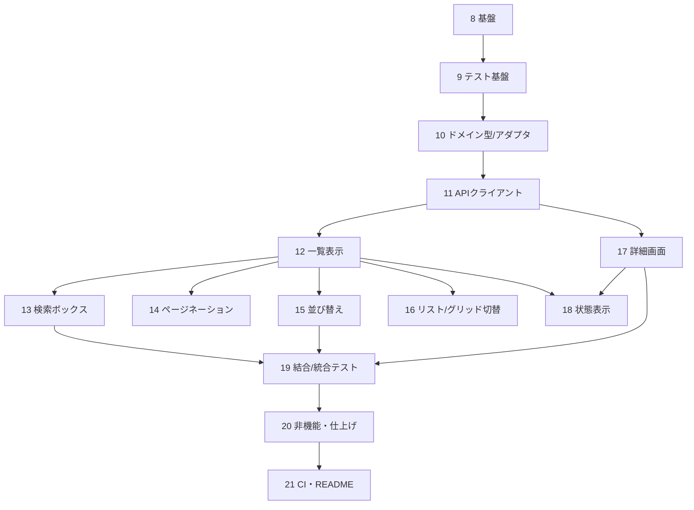

# タスク順序・一覧

> 順序の原則: ①依存関係の順（内側＝ドメインから外側＝UIへ）②各タスクは単体で完了確認できる単位。

---

## 設計タスク

### 1. 要件定義

- 実装課題の要件定義を行う
- 要件定義書 REQUIREMENTS.md の作成

### 2. 基本設計

- 要件定義書に沿って基本設計を行う
- 基本設計書 DESIGN.md の作成

### 3. 詳細設計

- 基本設計を基に、詳細設計を行う
- 詳細設計書 DETAIL_DESIGN.md を作成

### 4. API仕様調査

- GitHub REST API の利用範囲・制約・レスポンスを調査
- GITHUB_API.md の作成（検索/詳細エンドポイント、レート制限、Watcher数の罠）

### 5. 技術選定

- 言語・テスト・スタイリング・UI・補助ライブラリの選定と理由づけ
- 技術スタック書 TECH_STACK.md の作成
- 選定の自由度を3層（課題で固定／実質固定／自分で選ぶ）で整理

### 6. 設計判断の記録

- 思想・トレードオフの記録（テスト思想・状態管理方針など）
- 不採用判断の記録（ADR-001: 検索フィルター等）
- README骨子の作成（設計判断・やらないこと・AI利用レポートの章立て）

### 7. 実装前の意思決定確定

- 検索発火方式・デバウンス時間・per_page・エラーマッピング
- トークン未設定時の挙動・ディレクトリ構成・スタイリング適用方針

---

## 実装タスク

> 内側（ドメイン）→ 外界との境界（API）→ 画面（検索→詳細）→ 状態 → テスト → 仕上げ の順。
> テスト容易性のため、ロジックを先に確定し、表示は props のみ受け取る純粋な部品にする。

### 8. プロジェクト基盤

- create-next-app（Next 16 / App Router / TypeScript）でscaffold
- ディレクトリ構成・パスエイリアス（@/）・strict: true 設定
- スタイリング方針の適用（TECH_STACK.md に従う）
- .env.example の用意（GitHubトークン）

### 9. テスト基盤

- Vitest / Testing Library / MSW のセットアップ
- test/setup.ts・MSW handlers/server の雛形

### 10. ドメイン型とアダプタ（最内層・テストファースト）

- domain/repository.ts（Repository / RepositoryDetail）
- lib/github/types.ts（生レスポンス型）
- lib/github/adapters.ts（ACL: raw→domain、watchers=subscribers_count、language null、URLスキーム検証）
- 先にアダプタ単体テスト → 実装（要件 §3.5 アダプタ単体テスト）

### 11. GitHub APIクライアント

- lib/github/errors.ts（型付きエラー）
- lib/github/client.ts（ヘッダ・トークン付与・ステータス→型付きエラー変換）
- MSWで 403/404/422 を返すエラー写像テスト（要件 §3.5 クライアントエラーの写像）

### 12. 検索画面：一覧表示（基本）

- app/page.tsx（RSC・searchParams を await・検索API実行→アダプタ→描画）
- RepositoryList / RepositoryCard（表示専用・language null対応）
- 検索画面ルートで結果が出る最小状態（要件 §3.2）

### 13. 検索画面：検索ボックス（URL同期）

- SearchBox（client・デバウンス・2文字以上・useTransition・?q= を router.replace）
- 検索状態のURL同期（要件 §3.1）

### 14. 検索画面：ページネーション

- Pagination（?page= 更新・1000件上限クランプ・他クエリ保持）（要件 §3.2）

### 15. 検索画面：並び替え

- SortControl（関連度/Star/Fork/更新日時・?sort=&order=・変更時 page=1）（要件 §3.1）
- サーバーソート（API委譲）

### 16. 検索画面：リスト/グリッド切替

- ViewToggle（?view=list|grid・既定list）
- RepositoryList のレイアウト切替（カードは非依存）（要件 §3.2）

### 17. 詳細画面

- app/repositories/[owner]/[repo]/page.tsx（RSC・GET /repos/{owner}/{repo} 再取得）
- RepositoryDetail / StatBadge×4（Watcherは subscribers_count）
- ExternalLink（html_url・rel="noopener noreferrer"）（要件 §3.3）

### 18. 状態表示（4状態＋初期＋404）

- loading.tsx（スケルトン）/ error.tsx（再試行）/ EmptyState（0件）/ 初期表示
- 詳細の not-found.tsx + notFound()（要件 §3.4）

### 19. 結合・統合テスト

- 検索フロー結合テスト（入力→結果/0件→空/403→エラー、view切替含む）
- ソート統合テスト（sort/order反映・URL同期・page リセット）
- 詳細描画テスト（7項目・a11y・外部リンク）
- （要件 §3.5）

### 20. 非機能・仕上げ

- アクセシビリティ（ラベル・alt・キーボード・フォーカス可視）（要件 §4.4）
- next/image 最適化・数値compact表記・キャッシュ方針（要件 §4.1）
- generateMetadata（加点・任意）

### 21. CI・ドキュメント仕上げ

- GitHub Actions（lint / typecheck / test）（要件: プロダクション想定）
- README 完成（設計判断・やらないこと・使ったNext機能・AI利用レポート）

---

## 依存関係（要点）

- 10→11→12 が背骨（最内層から積む）。
- 13〜16 は 12（一覧）に依存する並列タスク。順番は任意だが、検索ボックス→ページネーション→並び替え→表示切替が自然。
- 状態表示（18）は各画面が出揃ってから横断で入れると重複が少ない。

---

## マイルストーン

| MS | 範囲 | 完了の目安 |
|---|---|---|
| MS1 設計完了 | 1〜7 | ドキュメント一式が揃い、実装前の判断が確定 |
| MS2 動く最小 | 8〜12 | キーワードで検索し一覧が出る |
| MS3 検索機能完成 | 13〜16 | URL同期・ページング・ソート・表示切替が動く |
| MS4 詳細・状態完成 | 17〜18 | 詳細表示と全状態が揃う |
| MS5 品質担保 | 19〜21 | テスト・非機能・CI・READMEが揃い提出可能 |
