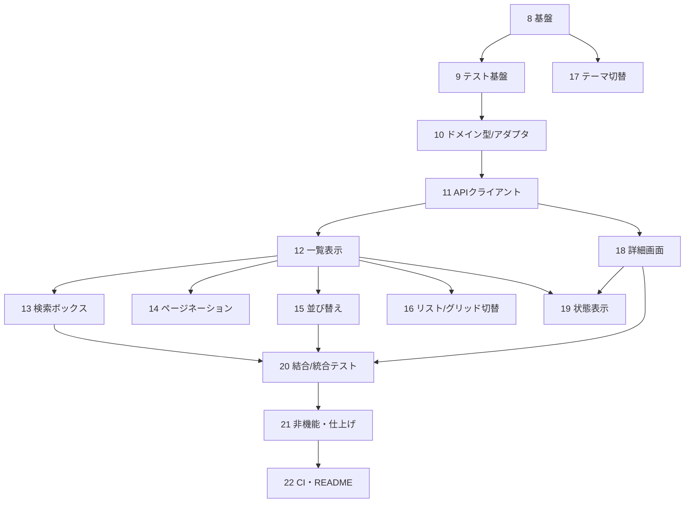

# タスク順序・一覧

> 順序の原則: ①依存関係の順（内側＝ドメインから外側＝UIへ）②各タスクは単体で完了確認できる単位。
> 凡例: [x] 完了 / [~] 一部残あり / [ ] 未着手
> **現在地: タスク8〜14 完了（基盤・テスト基盤・アダプタ・クライアント・一覧・検索ボックス・ページネーション）→ 次はタスク14.5（テスト前倒し）**

---

## 設計タスク

### 1. 要件定義 [x]

- 実装課題の要件定義を行う
- 要件定義書 REQUIREMENTS.md の作成
- 完了。submit方式・ソートAPI準拠・ダークモード（§3.5）・スコープ外の明記まで反映済み。DETAIL_REQUIREMENTS.md は廃止し REQUIREMENTS.md に一本化

### 2. 基本設計 [x]

- 要件定義書に沿って基本設計を行う
- 基本設計書 DESIGN.md の作成（ダークモード反映済み）

### 3. 詳細設計 [x]

- 基本設計を基に、詳細設計を行う
- 詳細設計書 DETAIL_DESIGN.md を作成
- 完了。機能軸＋コロケーションのディレクトリ、submit方式、テーマ（next-themes）、shadcn割り当て表まで反映済み

### 4. API仕様調査 [x]

- GitHub REST API の利用範囲・制約・レスポンスを調査
- GITHUB_API.md の作成（検索/詳細エンドポイント、レート制限、Watcher数の罠）

### 5. 技術選定 [x]

- 言語・テスト・スタイリング・UI・補助ライブラリの選定と理由づけ
- 技術スタック書 TECH_STACK.md の作成（不採用技術・確定バージョン・npm 採用まで反映済み）
- 選定の自由度を3層（課題で固定／実質固定／自分で選ぶ）で整理

### 6. 設計判断の記録 [x]

- 思想・トレードオフの記録 → DESIGN_PHILOSOPHY.md / UI_DESIGN_PHILOSOPHY.md / TEST_PHILOSOPHY.md（4層構造）作成済み
- 不採用判断の記録 → ADR-001（検索フィルター）作成済み
- README骨子作成済み（トークン取得手順含む）
- デザイントークン仕様 DESIGN_TOKENS.md 作成済み（モック最新版より抽出）

### 7. 実装前の意思決定確定 [x]

- 検索発火方式（submit方式に確定）・per_page=30・エラーマッピング（詳細設計 §4.1）
- トークン未設定時の挙動（認証なしで続行）・ディレクトリ構成（機能軸＋コロケーション）・スタイリング（Tailwind + shadcn/ui）

> 設計フェーズ完了（MS1クローズ）。

---

## 実装タスク

> 内側（ドメイン）→ 外界との境界（API）→ 画面（検索→詳細）→ 状態 → テスト → 仕上げ の順。
> テスト容易性のため、ロジックを先に確定し、表示は props のみ受け取る純粋な部品にする。

### 8. プロジェクト基盤 [x]

- create-next-app（Next 16.2 系 / App Router / TypeScript）でscaffold（npm）
- ディレクトリ構成・パスエイリアス（@/）・strict: true 設定
- Tailwind v4 + shadcn/ui 初期化（TECH_STACK.md に従う）
- .nvmrc / engines（Node 22 LTS）・.env.example（GitHubトークン）の用意

### 9. テスト基盤 [x]

- Vitest / Testing Library / MSW のセットアップ
- test/setup.ts・MSW handlers/server の雛形

### 10. ドメイン型とアダプタ（最内層・テストファースト） [x]

- domain/repository.ts（Repository / RepositoryDetail）
- lib/github/types.ts（生レスポンス型）
- lib/github/adapters.ts（ACL: raw→domain、watchers=subscribers_count、language null、URLスキーム検証）
- 先にアダプタ単体テスト → 実装（要件 §3.6 アダプタ単体テスト）

### 11. GitHub APIクライアント [x]

- lib/github/errors.ts（型付きエラー）
- lib/github/client.ts（ヘッダ・トークン付与・ステータス→型付きエラー変換）
- MSWで 403/404/422 を返すエラー写像テスト（要件 §3.6 クライアントエラーの写像）

### 12. 検索画面：一覧表示（基本） [x]

- app/page.tsx（RSC・searchParams を await・検索API実行→アダプタ→描画）
- RepositoryList / RepositoryCard（表示専用・language null対応）
- 検索画面ルートで結果が出る最小状態（要件 §3.2）

### 13. 検索画面：検索ボックス（submit方式・URL同期） [x]

- SearchBox（client・form submit（ボタン/Enter）・空送信無効・クリア(×)・useTransition）
- 送信で ?q= を router.push（新規検索時 page=1）（要件 §3.1）

### 14. 検索画面：ページネーション [x]

- Pagination（?page= 更新・1000件上限クランプ・他クエリ保持）（要件 §3.2）

### 14.5 テスト前倒し：①残り＋②＋③骨格 [ ]

- ①: format のユニットテスト
- ②: RepositoryCard / Pagination / SearchBox のコンポーネントテスト
- ③: 検索フローの結合テスト骨格（検索→一覧 / 0件→空 / 403→エラー / pageリセット）
- ブランチ: test/component-and-integration
- 以後、機能実装のたびに②③へ追記する運用（TEST_PHILOSOPHY.md §1）

### 15. 検索画面：並び替え [ ]

- SortControl（shadcn Select・関連度/Star/Fork/更新日時・?sort=&order=・変更時 page=1）（要件 §3.1）
- サーバーソート（API委譲）
- テスト追記: ③ソート統合（sort/order反映・pageリセット）

### 16. 検索画面：リスト/グリッド切替 [ ]

- ViewToggle（shadcn ToggleGroup・?view=list|grid・既定list）
- RepositoryList のレイアウト切替（カードは非依存）（要件 §3.2）
- テスト追記: ③view切替（URL同期・レイアウト反映）

### 17. テーマ切替（ダーク/ライトモード） [ ]

- ThemeProvider（next-themes ラッパ）を app/layout.tsx に設置
- ThemeToggle（components/theme・システム追従・localStorage 永続・FOUC対策）（要件 §3.5）
- ライト/ダーク双方のコントラスト確認（要件 §4.4）

### 18. 詳細画面 [ ]

- app/repositories/[owner]/[repo]/page.tsx（RSC・GET /repos/{owner}/{repo} 再取得）
- RepositoryDetail / StatBadge×4（Watcherは subscribers_count）
- ExternalLink（html_url・rel="noopener noreferrer"）（要件 §3.3）
- テスト追記: ②詳細系コンポーネント・③詳細描画（7項目・外部リンク）

### 19. 状態表示（4状態＋初期＋404） [ ]

- loading.tsx（スケルトン）/ error.tsx（再試行）/ EmptyState（0件）/ 初期表示
- 詳細の not-found.tsx + notFound()（要件 §3.4）

### 19.5 デザイン適用 [ ]

- DESIGN_TOKENS.md §7 の手順で実施（globals.css のテーマ変数上書き → フォント → Header → 各コンポーネント装飾 → アニメーション）
- shadcn/Tailwind の流儀で実装（モックのインラインstyleは移植しない）
- reduced-motion 対応
- ブランチ: feat/design-tokens

### 20. テスト総仕上げ [ ]

- 14.5以降の積み残し確認・抜けの補完（ソート統合・詳細描画・view切替が揃っているか）
- ④E2E（任意）: Playwright でハッピーパス1本（検索→結果→詳細→7項目）
- （要件 §3.6 / TEST_PHILOSOPHY.md §1）

### 21. 非機能・仕上げ [ ]

- アクセシビリティ（ラベル・alt・キーボード・フォーカス可視）（要件 §4.4）
- next/image 最適化・数値compact表記・キャッシュ方針（要件 §4.1）
- generateMetadata（加点・任意）

### 22. CI・ドキュメント仕上げ [ ]

- GitHub Actions（lint / typecheck / test）（要件: プロダクション想定）
- README 完成（設計判断・やらないこと・使ったNext機能・AI利用レポート）

---

## 依存関係（要点）

- 10→11→12 が背骨（最内層から積む）。
- 13〜16 は 12（一覧）に依存する並列タスク。検索ボックス→ページネーション→並び替え→表示切替が自然。
- テーマ切替（17）は基盤（8）にのみ依存し独立。どのタイミングでも実装可（shadcnテーマ変数と関わるため基盤直後〜画面実装と並行が効率的）。
- 状態表示（19）は各画面が出揃ってから横断で入れると重複が少ない。

---

## マイルストーン

| MS | 範囲 | 状態 | 完了の目安 |
| --- | --- | --- | --- |
| MS1 設計完了 | 1〜7 | **完了** | ドキュメント一式が揃い、実装前の判断が確定 |
| MS2 動く最小 | 8〜12 | **完了** | キーワードで検索し一覧が出る |
| MS3 検索機能完成 | 13〜17 + 14.5 | **進行中**（13・14 完了 ← ★次は 14.5） | URL同期・ページング・ソート・表示切替・テーマが動き、テストに守られている |
| MS4 詳細・状態完成 | 18〜19.5 | 未着手 | 詳細表示・全状態・デザイン適用が揃う |
| MS5 品質担保 | 20〜22 | 未着手 | テスト総仕上げ・非機能・CI・READMEが揃い提出可能 |
